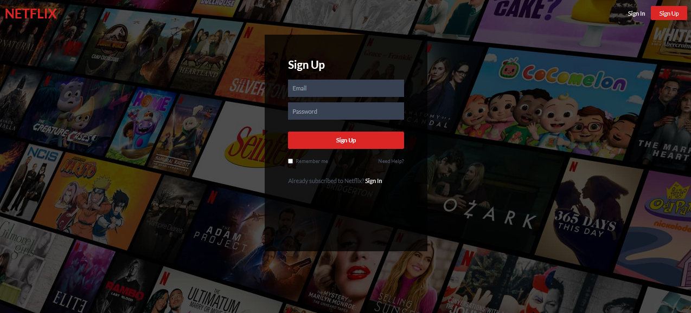
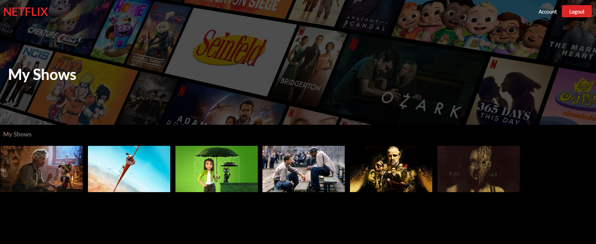

# Netflix clone using ReactJS

Deployed app to firebase [Demo App](https://netflix-react-dd022.web.app/)

- This is a RectJS front-end Netflix clone with a Firebase back-end.
- I use the TMDB API for all of the data. 
- Firebase Authentication to give login functionality. 
- Store user specific data with a React front-end and a Firebase back-end. 
- Firestore a cloud storage with Firebase to save data. 
- TailwindCSS to style the front end
  - an incredible CSS framework to save time styling your apps. 
- Deployed to Firebase hosting.

  

  

  

